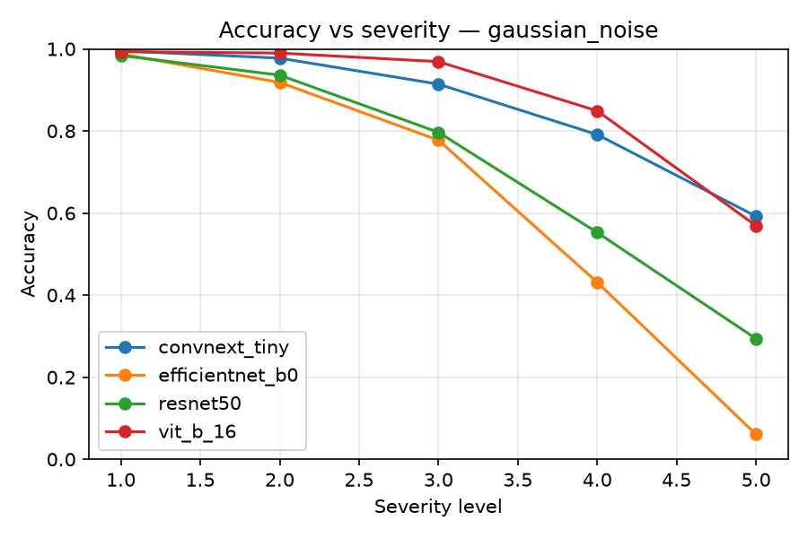
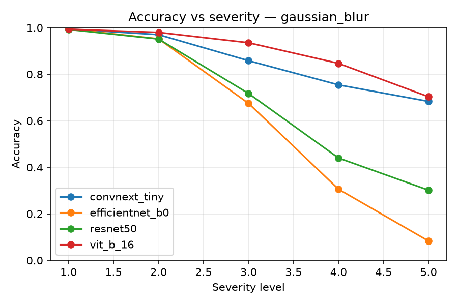
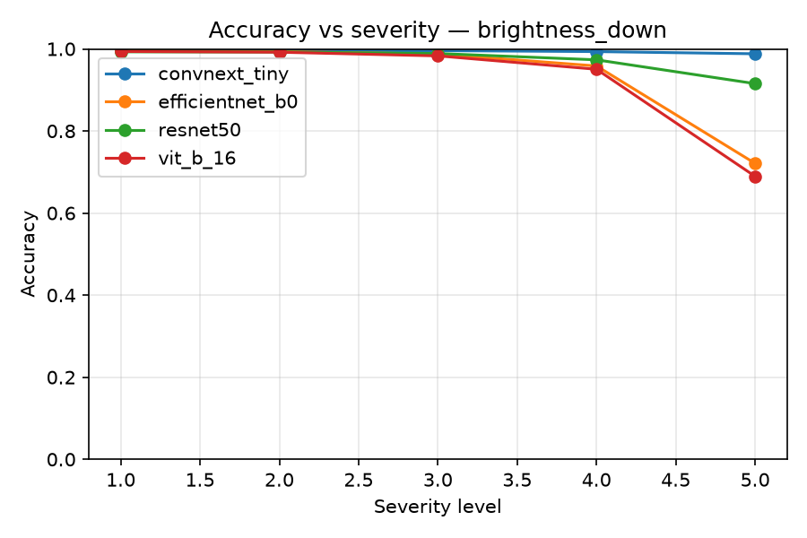
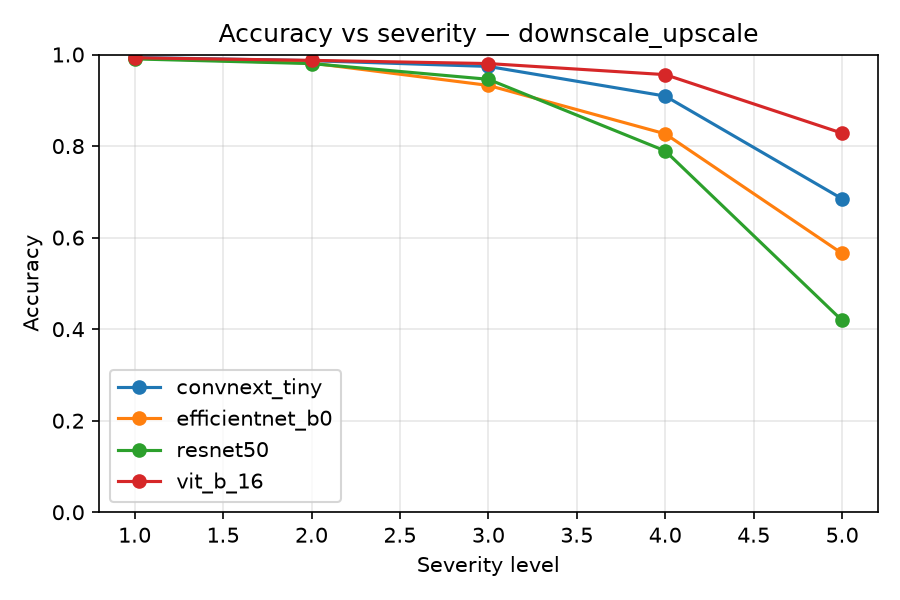
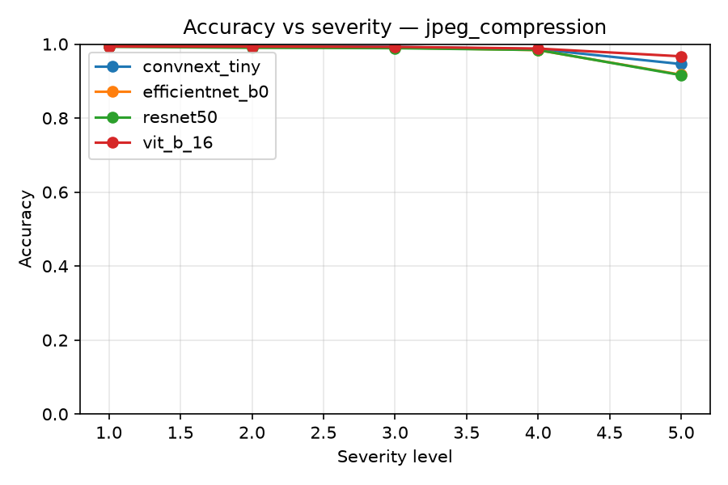

# Evaluating the Robustness of Modern Deep Learning Models to Image Quality Degradation in Plant Disease Diagnosis from Leaf Photographs

*Results are based on a full run of the pipeline described in Section IV:
four architectures × (1 clean + 5 corruption types × 5 severity levels) on
the official PlantVillage test set (n = 10,709). Raw per-run metrics and
summary tables are available in `results/` and `graphs/` in the
accompanying code repository.*

---

## Abstract

Deep learning models report near-ceiling accuracy (>99%) on the
PlantVillage benchmark for plant disease diagnosis, but this accuracy is
measured on laboratory-quality images, not the degraded photographs
produced by real smartphone capture. We evaluate four architectures —
ResNet-50, EfficientNet-B0, ConvNeXt-Tiny, and ViT-B/16 — fine-tuned on
PlantVillage, under five types of synthetic image degradation (Gaussian
blur, Gaussian noise, brightness reduction, JPEG compression,
downscale–upscale), each at five severity levels, following the ImageNet-C
protocol. While all four models exceed 99% clean-test accuracy, robustness
under degradation diverges sharply and does not track clean accuracy: a
Friedman test finds significant differences among architectures
(χ² = 34.40, p < 10⁻⁶), with ConvNeXt-Tiny and ViT-B/16 significantly more
robust than ResNet-50 and EfficientNet-B0 (Nemenyi post-hoc, α = 0.05).
Most notably, EfficientNet-B0 — despite the second-highest clean accuracy
of the four models — is the least robust overall (mean Corruption Error =
1.349, normalized to ResNet-50 = 1.0; worst among all models) and
collapses to a single dominant prediction under severe Gaussian noise
(6.1% accuracy, near the 2.6% random-guessing baseline for 38 classes,
i.e. crop–condition pairs). Gaussian noise and blur cause
substantially larger accuracy drops than JPEG compression, which nearly
all models tolerate well even at maximum tested severity. These results
show that clean-dataset accuracy is an unreliable proxy for real-world
reliability, and that corruption robustness should be evaluated and
reported alongside standard accuracy metrics for plant disease diagnosis
models intended for deployment on user-captured smartphone photographs.
All four architectures were fine-tuned with an identical, shared recipe
rather than architecture-specific tuning, so the reported ranking reflects
relative robustness under that shared recipe.

**Keywords:** plant disease classification, image corruption robustness,
deep learning, convolutional neural networks, vision transformers,
PlantVillage

## I. Introduction

Modern deep learning models achieve remarkably high accuracy in automated
plant disease diagnosis from leaf photographs. Mohanty, Hughes, and
Salathé [1] reported 99.35% accuracy on PlantVillage using GoogLeNet and
AlexNet, and comparable results have since been reproduced widely,
creating the impression that the task is largely solved.

However, these results were obtained under controlled conditions:
PlantVillage consists of photographs of individual leaves against a
uniform background under even lighting [2]. A real-world user
photographing a plant with a smartphone faces different conditions:
insufficient lighting, camera shake, sensor noise, and compression
artifacts. This raises a natural question: does the reported accuracy
hold when only the technical quality of the image changes, while its
content remains the same?

This question is distinct from the well-studied problem of domain shift
between laboratory and field photographs, which typically involves
changes in background, viewing angle, and number of leaves in frame [3].
The present study instead isolates a narrower factor — image quality
degradation with fixed frame content — allowing its contribution to be
assessed independently of domain shift.

## II. Related Work

**High accuracy on controlled datasets.** PlantVillage remains the most
widely used open dataset for plant disease classification, with
approximately 54,300 images covering 14 crop species and 26 diseases [2],
organized as 38 classification classes (each class is a crop–condition
pair, e.g. "Corn healthy" and "Corn common rust" are separate classes;
this is the class count used for all accuracy figures reported below). Of
these ≈54,300 images, the held-out test partition — on which all
accuracy, robustness, and statistical results in this paper are computed
— contains 10,709 images (Section IV-A); the remainder form the
train/validation partitions used only for fine-tuning and are never seen
during evaluation.
Classification accuracy near or above 99% has been repeatedly demonstrated
on it [1], establishing it as a de facto benchmark.

**Domain shift: laboratory vs. field.** Starting with Singh et al. [3],
who introduced the PlantDoc dataset of 2,598 field photographs, the
literature consistently reports substantial accuracy drops when models
trained on PlantVillage are transferred to field images. This line of
research conflates multiple factors simultaneously — background,
viewpoint, lighting — and does not isolate purely technical image
quality.

**Robustness to synthetic corruptions.** A separate line of work in
computer vision addresses robustness to technical corruptions — blur,
noise, compression — while frame content is held fixed. The foundational
study is Hendrycks and Dietterich [4], who proposed the ImageNet-C
benchmark (15 corruption types at 5 severity levels) and the mean
Corruption Error (mCE) metric. This protocol is now a de facto standard
for robustness evaluation in general image classification.

**Gap in the literature.** At the intersection of these two lines — plant
disease diagnosis and corruption-robustness evaluation — no dedicated
study was found. This motivates the present study: to systematically
evaluate, under otherwise identical conditions, how degradation in
technical image quality alone reduces the accuracy of modern
architectures.

## III. Problem Statement

**Objective.** To evaluate the effect of image quality degradation on the
accuracy of modern deep learning models in plant disease diagnosis from
leaf photographs.

**Object of study:** ResNet-50 [5], EfficientNet-B0 [6], ConvNeXt-Tiny
[7], and ViT-B/16 [8]. **Subject of study:** change in classification
quality metrics under controlled degradation of image technical quality.

**Research questions.**
- **RQ1.** How does accuracy change under image degradation, across
  corruption types and severity levels?
- **RQ2.** Which degradation types have the largest impact on accuracy?
- **RQ3.** Do convolutional networks and a transformer differ in
  robustness to image degradation?

**Hypotheses.**
- **H1.** Degradation reduces accuracy, with the drop increasing with
  severity.
- **H2.** Architectures differ significantly in robustness.
- **H3.** Corruption types affect accuracy unevenly.

## IV. Materials and Methods

### A. Dataset

The primary dataset is PlantVillage [2], loaded via the Hugging Face Hub
(`mohanty/PlantVillage`), using the authors' predefined leaf-grouped
train/test split (80/20), which prevents images of the same leaf from
appearing in both partitions. A validation set (15% of train, stratified,
seed = 42) is carved from the training partition. This yields a test set
of **10,709 images** — the *n* used for every accuracy, robustness, and
statistical result reported in this paper — out of the ≈54,300 images in
the full dataset (Section II); the remaining ≈43,600 images make up the
train and validation partitions, which are used only for fine-tuning and
model selection and are never evaluated on.

**Limitation:** images were captured under controlled laboratory
conditions, which does not reflect field-photography variability. This is
deliberately accepted, since the controlled background is precisely what
allows technical image quality to be isolated from domain shift (Section
II).

### B. Models

| Architecture | Year | Type |
|---|---|---|
| ResNet-50 [5] | 2016 | Convolutional network |
| EfficientNet-B0 [6] | 2019 | Convolutional network |
| ConvNeXt-Tiny [7] | 2022 | Convolutional network (modern) |
| ViT-B/16 [8] | 2020 | Transformer |

All four are pretrained on ImageNet and fine-tuned on PlantVillage using a
two-phase strategy: linear probing with a frozen backbone, followed by
full backbone fine-tuning at a reduced learning rate.

**Experimental setup.** All four models were fine-tuned with an identical,
non-architecture-specific recipe on a single consumer-grade NVIDIA GeForce
RTX 4060 GPU (8 GB VRAM), to isolate architecture effects from
hyperparameter-tuning effects: AdamW optimizer, weight decay 1×10⁻⁴;
batch size 32; input resolution 224×224; 15 epochs total (2 epochs
frozen-backbone linear probing at LR 3×10⁻⁴, then 13 epochs full
fine-tuning at LR 3×10⁻⁵); best checkpoint selected by validation
macro-F1; random seed 42. No per-architecture hyperparameter search was
performed (see Threats to Validity, Section VI-C).

### C. Types and Levels of Image Degradation

Five types of synthetic corruption are applied to the test set only, each
at five severity levels, following the ImageNet-C protocol [4]:

1. **Gaussian blur** — camera shake and defocus.
2. **Gaussian noise** — sensor noise under low light.
3. **Brightness reduction** — insufficient lighting.
4. **JPEG compression** — artifacts from heavy compression.
5. **Downscale–upscale** — detail loss from low resolution or resizing.

Corruptions are applied only to the test set; the training set is
unmodified, so that measured effects reflect out-of-the-box robustness
rather than an augmentation effect.

**Rationale for corruption selection.** We use a five-type subset of the
full 15-type ImageNet-C benchmark [4] because: (1) weather corruptions
(snow, frost, fog) do not apply physically to close-range leaf
photography; (2) several remaining types are redundant for this use case
(shot/impulse noise share Gaussian noise's mechanism; pixelate and
downscale–upscale both model resolution loss); (3) the five retained
types each map to a specific, common smartphone-capture failure mode.
This is a scope decision, not a claim that excluded types are
unimportant; they are noted as future work (Section VI).

### D. Evaluation Metrics

For each (model, corruption condition) pair, we compute accuracy;
precision, recall, and F1 (macro- and weighted-averaged); confusion
matrices and per-class metrics; and mean Corruption Error (mCE),
normalized against ResNet-50 as baseline, following [4].

### E. Statistical Analysis

To test H1–H3 (α = 0.05), we use the **Friedman test** (differences among
architectures across corruption conditions), the **Nemenyi post-hoc test**
(pairwise comparison when Friedman is significant), and the **Wilcoxon
signed-rank test** (comparing a model's accuracy between adjacent severity
levels).

### F. Reproducibility

The full pipeline (data preparation, training, corruption generation,
evaluation, statistical analysis) is published as an open codebase (see
Code and Data Availability). All stochastic processes use a fixed
seed = 42; full bitwise determinism at the CUDA-kernel level is not
guaranteed, a standard limitation of GPU training.

## V. Results

Table I reports clean-test accuracy for all four architectures before any
corruption is applied. All models achieve very high baseline accuracy
(>99.3%), consistent with prior work on PlantVillage [1].

**Table I. Clean-test accuracy (n = 10,709).**

| Model | Accuracy |
|---|---|
| ConvNeXt-Tiny | 0.9973 |
| EfficientNet-B0 | 0.9962 |
| ViT-B/16 | 0.9941 |
| ResNet-50 | 0.9931 |

### A. RQ1 — Accuracy under degradation

All four models exceed 99% accuracy on clean test images. Accuracy
declines monotonically with severity for every model and corruption type.
A Wilcoxon signed-rank test comparing paired (model, corruption) accuracy
at severity 1 versus severity 5, across all 20 combinations, confirms this
decrease is highly significant (W = 210, p = 9.5 × 10⁻⁷), supporting
**H1**. The rate and shape of decline, however, differ sharply by
corruption type and architecture (see below), so a single degradation
coefficient does not describe the effect uniformly.

### B. RQ2 — Effect of corruption type

Table II reports accuracy at the highest severity level (5) for each
(model, corruption) pair; Fig. 1–5 below show the full accuracy-vs-severity
curves underlying it.

**Table II. Accuracy at severity 5, by model and corruption type.**

| Model | Brightness↓ | Downscale/Up | Gaussian Blur | Gaussian Noise | JPEG |
|---|---|---|---|---|---|
| ConvNeXt-Tiny | 0.988 | 0.685 | 0.683 | 0.592 | 0.946 |
| EfficientNet-B0 | 0.721 | 0.565 | **0.083** | **0.061** | 0.917 |
| ResNet-50 | 0.915 | 0.419 | 0.302 | 0.294 | 0.916 |
| ViT-B/16 | 0.689 | 0.828 | 0.703 | 0.569 | 0.967 |

Gaussian noise and blur cause the largest accuracy drops, while JPEG
compression is tolerated well by nearly all models (>91% accuracy even at
maximum severity), supporting **H3**.

As Fig. 1 shows, under Gaussian noise all four models decline steadily
with severity, but EfficientNet-B0 (orange) separates from the other
three from severity 3 onward and collapses to 6.1% accuracy at severity 5
— near the 2.6% random-guessing baseline for 38 classes. Inspection of
the confusion matrix shows this is not random guessing but mode collapse:
74% of all 10,709 predictions are assigned to a single class
("Corn_(maize)\_\_\_healthy"), with 18 of 38 classes receiving zero
predictions. ResNet-50 (green) degrades under the same condition without
collapsing (29–30% accuracy at severity 5), indicating the failure mode is
architecture-specific rather than a property of the corruption itself.

**Fig. 1.** Accuracy vs. severity level under Gaussian noise, across all
four architectures.

Gaussian blur (Fig. 2) produces a similar pattern to noise: ConvNeXt-Tiny
and ViT-B/16 remain well above 68% accuracy even at severity 5, while
EfficientNet-B0 and ResNet-50 fall below 45%, with EfficientNet-B0 the
weakest of the four (8.3% at severity 5).

**Fig. 2.** Accuracy vs. severity level under Gaussian blur, across all
four architectures.

Brightness reduction (Fig. 3) and downscale–upscale (Fig. 4) are
intermediate in impact: all models stay above 90% accuracy through
severity 3–4, with a visible drop only at severity 5, and the same
architecture ordering (ConvNeXt-Tiny and ViT-B/16 more robust than
ResNet-50 and EfficientNet-B0) reappears at the highest severity level.

**Fig. 3.** Accuracy vs. severity level under brightness reduction, across
all four architectures.

**Fig. 4.** Accuracy vs. severity level under downscale–upscale, across
all four architectures.

JPEG compression (Fig. 5) is by far the mildest corruption tested: all
four curves remain within a narrow band above 91% accuracy across the
full severity range, with almost no separation between architectures —
consistent with JPEG compression's low contribution to overall corruption
error (Section V-C).

**Fig. 5.** Accuracy vs. severity level under JPEG compression, across all
four architectures.

### C. RQ3 — Differences between architectures

A Friedman test across all 25 (corruption × severity) conditions finds a
significant difference in accuracy ranking among the four models
(χ² = 34.40, p = 1.6 × 10⁻⁷), supporting **H2**. Average ranks (1 = best):
ConvNeXt-Tiny 1.58, ViT-B/16 1.94, EfficientNet-B0 3.12, ResNet-50 3.36.

A Nemenyi post-hoc test (CD = 0.94, α = 0.05) shows ConvNeXt-Tiny and
ViT-B/16 are not significantly different from each other (both most
robust); both are significantly more robust than EfficientNet-B0 and
ResNet-50; and EfficientNet-B0 and ResNet-50 are not significantly
different from each other (both least robust, for different reasons — see
Table III).

**Table III. Mean Corruption Error (mCE), normalized to ResNet-50 = 1.0.**

| Model | mCE |
|---|---|
| ConvNeXt-Tiny | 0.471 |
| ViT-B/16 | 0.886 |
| ResNet-50 | 1.000 (baseline) |
| EfficientNet-B0 | 1.349 |

Ranking by clean-test accuracy alone would put EfficientNet-B0 (0.9962)
nearly tied with ConvNeXt-Tiny (0.9973) and ahead of ResNet-50 (0.9931).
The robustness ranking inverts this: EfficientNet-B0 is the *least*
robust model overall despite the second-highest clean accuracy. This
dissociation between clean accuracy and corruption robustness is a
central finding of this study.

## VI. Discussion

The results support all three hypotheses: degradation reliably reduces
accuracy (H1), the effect is uneven across corruption types (H3), and
architectures differ significantly in robustness (H2) — but not in the
way clean-accuracy leaderboards would predict.

**Clean accuracy vs. robustness.** A practitioner selecting an
architecture based solely on PlantVillage benchmark accuracy — standard
practice in prior work on this dataset [1] — would judge EfficientNet-B0
an excellent, near-top-tier choice. Under realistic degradation, it is
instead the architecture most likely to fail, and to fail *silently* via
mode collapse rather than graceful degradation. For a diagnostic tool
where users act on model output, a confident wrong answer is arguably
worse than a visible failure — a risk clean-accuracy benchmarks do not
surface.

**Deployment implications.** JPEG compression — arguably the most common
real-world degradation, since nearly every transmitted or web-uploaded
image is JPEG-recompressed — was the *least* damaging corruption tested.
Gaussian noise and blur, associated with low-light capture and camera
shake, caused the largest drops. This suggests user guidance such as
"hold the camera steady" and "ensure adequate lighting" may matter more
for reliability than warnings about compression or file size.

**Convolutional vs. transformer.** ConvNeXt-Tiny and ViT-B/16 converge as
the two significantly more robust architectures despite one being
convolutional and the other a transformer, suggesting robustness here may
be driven less by self-attention and more by architectural modernization
and training recipe more broadly. Since all four models were fine-tuned
identically, this study cannot fully disentangle architecture family from
recipe — a direction for follow-up work.

### A. Why does accuracy decrease under corruption?

This pattern is not specific to plant imagery; it reflects a general
property of learned feature extractors documented in the robustness
literature [4]. Each corruption perturbs a different statistical
regularity the model relies on: **blur** removes fine-grained texture cues
(e.g., early-lesion speckling); **noise** injects high-frequency content
absent from training, spuriously activating early-layer filters;
**brightness reduction** shifts inputs outside the intensity range that
normalization statistics were calibrated for; **JPEG compression**
discards high-frequency detail but preserves global color/shape
statistics, consistent with its mild impact; and **downscale–upscale**
compounds mild blur and interpolation artifacts, consistent with its
intermediate impact.

EfficientNet-B0's mode collapse is plausibly explained by its aggressive
channel scaling and lower parameter count relative to the other three
architectures, which may leave its representations less redundant and
more brittle once inputs move far outside the training distribution — a
hypothesis consistent with its known parameter efficiency [6] but not
directly tested here (e.g., via activation analysis), and left for future
work.

### B. Toward more robust systems

This study measures robustness rather than testing interventions. Grounded
in the general robustness literature, plausible mitigation directions
include: **corruption-aware augmentation** such as AugMix [9], which
improves ImageNet-C robustness without degrading clean accuracy, and would
not violate this study's train/test separation as long as evaluation
corruptions are excluded from the augmentation pool; **uncertainty-aware
deployment** (e.g., ensembling [10]) to flag low-confidence predictions
for human review rather than presenting a confidently wrong diagnosis —
particularly relevant given the EfficientNet-B0 finding; **robustness-
informed architecture selection**, reporting mCE-style metrics alongside
accuracy as a low-cost addition to standard model-selection practice; and
**domain- and quality-diverse training data**, incorporating field images
of varying technical quality, going beyond the domain-shift-only focus of
datasets such as PlantDoc [3].

### C. Threats to Validity

**Construct validity.** The five corruption functions (`degrade.py`) are
software approximations of real capture artifacts, not calibrated
physical models of a specific sensor or lens. Severity levels are ordinal
and verified monotonic (Section IV) but not calibrated to a real-world
physical unit; "severity 5" denotes the most severe level tested, not a
specific real-world condition.

**Internal validity.** All four models share an identical fine-tuning
recipe rather than architecture-specific tuning, isolating the comparison
from unequal tuning effort but meaning absolute robustness could change
under a different recipe — the *relative* ranking under a shared recipe is
the primary claim. A single training run per (architecture, condition) was
used rather than multiple seeds; the statistical tests treat corruption
conditions, not training seeds, as the unit of repeated measurement.

**External validity.** PlantVillage's laboratory conditions mean these
results characterize sensitivity to *technical* degradation in isolation,
not robustness to the full combination of factors present in field
deployment (cf. [3]). Whether this architecture ranking transfers to other
datasets, taxonomies, or real (non-synthetic) field degradation remains
open. Robustness was evaluated only for models fine-tuned on clean data;
whether training-time exposure to corruptions would close the gap is a
direct, testable extension deliberately left open here, since answering it
would conflate augmentation effects with the architectural-robustness
question this study isolates.

## VII. Conclusion

This study evaluated the robustness of four modern architectures —
ResNet-50, EfficientNet-B0, ConvNeXt-Tiny, and ViT-B/16 — to five types of
synthetic image degradation at five severity levels, in plant disease
classification from leaf photographs. All models achieve near-ceiling
clean accuracy (>99%), but robustness under degradation varies sharply and
is not predicted by clean accuracy: ConvNeXt-Tiny and ViT-B/16 are
significantly more robust than ResNet-50 and EfficientNet-B0 (Friedman
χ² = 34.40, p < 10⁻⁶; Nemenyi post-hoc, α = 0.05), and EfficientNet-B0 —
despite the second-best clean accuracy — is least robust overall
(mCE = 1.349) and exhibits mode collapse under severe noise and blur.
Among corruption types, Gaussian noise and blur are substantially more
damaging than JPEG compression or brightness reduction. These findings
indicate that clean-dataset accuracy alone is insufficient for selecting a
model architecture for real-world, smartphone-based plant disease
diagnosis tools, and that corruption robustness should be reported and
evaluated alongside standard accuracy metrics in future work on this
task. As all four architectures shared an identical fine-tuning recipe
(Section IV-B), this ranking reflects relative robustness under that
recipe, not necessarily an architecture's best-achievable robustness.

## Code and Data Availability

All code required to reproduce every result, table, and figure in this
paper — data acquisition, model fine-tuning, corruption generation,
evaluation, and statistical analysis — is publicly available at:
**https://github.com/\<your-username\>/PlantAIResearch** *(replace with
your actual repository URL before submission/publication)*.

The repository includes a full README with per-script documentation,
installation instructions, and the exact commands used to produce the
results reported here. Trained model checkpoints and raw per-run result
files (JSON) are not committed to the repository due to size, but can be
regenerated by following the documented pipeline, or made available by
the authors upon reasonable request.

The PlantVillage dataset used in this study is publicly available at
https://huggingface.co/datasets/mohanty/PlantVillage and is distributed by
its original authors [1], [2] under the terms specified on that page.

## References

[1] S. P. Mohanty, D. P. Hughes, and M. Salathé, "Using deep learning for image-based plant disease detection," *Frontiers in Plant Science*, vol. 7, p. 1419, 2016, doi: 10.3389/fpls.2016.01419.

[2] D. P. Hughes and M. Salathé, "An open access repository of images on plant health to enable the development of mobile disease diagnostics," *arXiv:1511.08060*, 2015.

[3] D. Singh, N. Jain, P. Jain, P. Kayal, S. Kumawat, and N. Batra, "PlantDoc: A dataset for visual plant disease detection," in *Proc. 7th ACM IKDD CoDS and 25th COMAD*, Hyderabad, India, 2020, pp. 249–253, doi: 10.1145/3371158.3371196.

[4] D. Hendrycks and T. Dietterich, "Benchmarking neural network robustness to common corruptions and perturbations," in *Proc. Int. Conf. Learning Representations (ICLR)*, 2019.

[5] K. He, X. Zhang, S. Ren, and J. Sun, "Deep residual learning for image recognition," in *Proc. IEEE Conf. Computer Vision and Pattern Recognition (CVPR)*, 2016, pp. 770–778.

[6] M. Tan and Q. Le, "EfficientNet: Rethinking model scaling for convolutional neural networks," in *Proc. Int. Conf. Machine Learning (ICML)*, 2019.

[7] Z. Liu, H. Mao, C.-Y. Wu, C. Feichtenhofer, T. Darrell, and S. Xie, "A ConvNet for the 2020s," in *Proc. IEEE/CVF Conf. Computer Vision and Pattern Recognition (CVPR)*, 2022.

[8] A. Dosovitskiy et al., "An image is worth 16x16 words: Transformers for image recognition at scale," in *Proc. Int. Conf. Learning Representations (ICLR)*, 2021.

[9] D. Hendrycks, N. Mu, E. D. Cubuk, B. Zoph, J. Gilmer, and B. Lakshminarayanan, "AugMix: A simple data processing method to improve robustness and uncertainty," in *Proc. Int. Conf. Learning Representations (ICLR)*, 2020.

[10] B. Lakshminarayanan, A. Pritzel, and C. Blundell, "Simple and scalable predictive uncertainty estimation using deep ensembles," in *Advances in Neural Information Processing Systems (NeurIPS)*, vol. 30, 2017.
